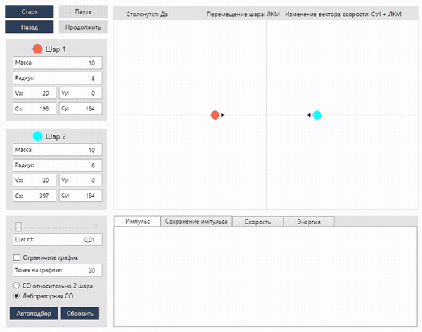

# BallCollisionSim

Моделирование движения двух шаров с абсолютно упругим столкновением.  
Интерактивная настройка начальных координат, скоростей и радиусов, автоматическое построение графиков импульса, скоростей и кинетической энергии.

---

## Стек технологий

| Компонент               | Технология                                                    |
|-------------------------|---------------------------------------------------------------|
| Язык                    | C# 8.0                                                        |
| Платформа               | .NET Framework 4.7.2                                          |
| UI                      | WPF + Windows Forms (`PictureBox`)                            |
| Построение графиков     | `System.Windows.Forms.DataVisualization.Charting`             |
| Обновление интерфейса   | `Dispatcher`                                                  |

---

## Сборка и запуск

1. Клонировать репозиторий:  
   ```bash
   git clone https://github.com/your-repo/BallCollisionSim.git
   cd BallCollisionSim
   ```
2. Собрать и запустить:
   - **Visual Studio 2019+**: открыть `BallCollisionSim.sln`, выбрать Release → Построить → Запустить.
   - **CLI**:
     ```bash
     msbuild BallCollisionSim.sln /p:Configuration=Release
     start bin\Release\BallCollisionSim.exe
     ```
> Требуется установленный .NET 4.7.2 SDK на Windows 10/11.

---

## Управление

- **Start / Pause / Back** — запуск, пауза, сброс симуляции.
- **Текстовые поля** — ввод массы, радиуса, координат и скоростей шаров.
- **Слайдер dt** — шаг интегрирования (мс).
- **Ctrl + клик** по шару — задаёт новый вектор скорости.
- **Random** — случайная генерация параметров, гарантирующая столкновение.

---

## Демонстрация

<p align="center">
  
</p>
